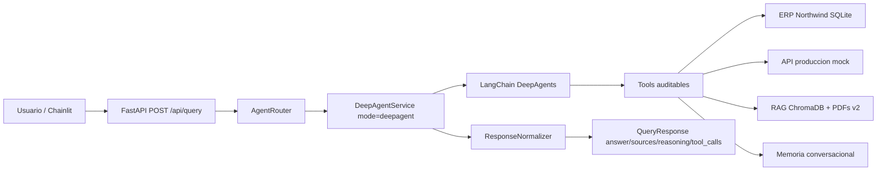

# nunsysIA

## Descripcion

nunsysIA es una POC de workflow agentic con LangChain DeepAgents como
orquestador principal para responder consultas de negocio en lenguaje natural
combinando datos de ERP, una API REST de produccion y documentos PDF indexados
mediante RAG.

El objetivo no es sustituir sistemas corporativos reales, sino demostrar una
orquestacion agentic trazable: el sistema consulta fuentes, ejecuta tools,
combina evidencias y devuelve una respuesta con `answer`, `sources` y
`reasoning`.

## Funcionalidades principales

- Consultas sobre ERP/Northwind con clientes, pedidos, estados e importes.
- Consultas sobre API REST de produccion con estados, bloqueos y retrasos.
- Combinacion de fuentes ERP + produccion por `order_id`.
- RAG sobre PDFs subidos e indexados en ChromaDB con embeddings reales.
- Endpoint principal `POST /api/query`.
- Respuestas trazables con `answer`, `sources`, `reasoning`, `tool_calls`,
  `fallbacks`, `status` y `data`.
- Interfaz grafica con Chainlit.
- Ejecucion con Docker y Docker Compose.

## Requisitos de la prueba cubiertos

| Requisito | Implementacion verificable |
| --- | --- |
| ERP Northwind | SQLite sembrado con `data/northwind_seed.sql` y consultado por `app/tools/erp_tool.py`. |
| Produccion via API REST | Servicio `production_mock/` levantado por Compose en `production-api`. |
| Fusion ERP + produccion | `app/agents/deepagents_tools_service.py` cruza pedidos por `order_id`. |
| RAG documental | `app/rag/` usa PDFs subidos, embeddings reales y ChromaDB. |
| Endpoint obligatorio | `POST /api/query` en `app/api/routes_query.py`. |
| `answer`, `sources`, `reasoning` | Contrato `QueryResponse` normalizado por `app/services/response_normalizer.py`. |
| Trazabilidad | `tool_calls`, `metadata.request_id`, `metadata.duration_ms`, `fallbacks` y `status`. |
| DeepAgents | Flujo por defecto `mode=deepagent`; LangGraph queda como `legacy_langgraph`. |
| UI | Chainlit en `chainlit_app/main.py`, puerto `8002` en Compose. |
| Docker | `Dockerfile`, `docker-compose.yml` y perfil `eval` para validacion end-to-end. |

## Flujo principal actual

El flujo de entrega es unico y explicito:

```text
Usuario / Chainlit
-> FastAPI POST /api/query
-> AgentRouter
-> mode=deepagent
-> DeepAgentService
-> LangChain DeepAgents + tools de negocio
-> ResponseNormalizer
-> QueryResponse
```



DeepAgents es el modo por defecto real del endpoint de negocio mientras
`AGENT_MODE=deepagent`, que es la configuracion de entrega. El servicio
principal puede ejecutar tools deterministas obligatorias antes y despues de la
invocacion agentic para garantizar trazabilidad y evitar respuestas no
grounded; esa logica forma parte del guardrail de entrega, no de un flujo
paralelo.

El flujo activo no registra subagents de DeepAgents. Las capacidades
especializadas de ERP, produccion, RAG y memoria se exponen como tools directas
de negocio y se validan con evidencias antes de construir la respuesta.

Componentes reales:

- `app/api/routes_query.py`: endpoint `POST /api/query`.
- `app/api/routes_documents.py`: subida y listado de documentos.
- `app/agents/router.py`: seleccion del modo agentic.
- `app/agents/deep_agent.py`: envoltorio del servicio principal.
- `app/agents/deepagents_tools_service.py`: flujo principal con DeepAgents y
  tools directas de ERP, produccion, RAG y memoria.
- `app/agents/deepagents_policy.py`: politica de seleccion de tools por
  intencion.
- `app/agents/deepagents_harness.py`: registro del harness DeepAgents con
  perfil de negocio acotado, sin tools genericas de filesystem o shell.
- `app/agents/deepagents_answering.py`: respuestas deterministas grounded
  cuando ya hay evidencia de tools.
- `app/services/response_normalizer.py`: normaliza la salida a `QueryResponse`.
- `app/tools/`: tools deterministas para ERP, produccion, RAG, memoria y Query
  DSL interna.
- `app/rag/`: ingestion, chunking, embeddings, vector store y retrieval.
- `production_mock/`: API REST mock de produccion.
- `chainlit_app/`: interfaz Chainlit conectada al backend.

## Flujos legacy/experimentales

- Flujo principal: `mode=deepagent`. Es el modo por defecto de `/api/query`.
- Flujo alternativo: `mode=deepagent_sidecar`. DeepAgents delega en el workflow
  legacy y se conserva para comparativas.
- Flujo legacy o experimental: `mode=legacy_langgraph`. Mantiene el flujo
  anterior basado en LangGraph para regresion tecnica. No es la arquitectura
  principal de entrega.

Los endpoints `/api/experimental/deepagents/*` estan deshabilitados por defecto
y solo se activan con `ENABLE_DEEPAGENTS_EXPERIMENT=true`.
Los servicios `deepagent_sidecar` y `legacy_langgraph` se cargan bajo demanda;
no se instancian durante consultas normales con `mode=deepagent`.

## Decisiones tecnicas

- LangChain / DeepAgents: se usa como motor principal para que el agente pueda
  decidir y ejecutar tools de negocio en consultas multi-fuente.
- Tools: encapsulan acceso a ERP, produccion, memoria y RAG. Esto evita que el
  agente invente datos o acceda directamente a infraestructura.
- RAG: permite responder preguntas sobre PDFs subidos, con chunks y metadatos
  auditables.
- Documentos de demo: los PDFs oficiales de entrega son los `v2_*` de
  `data/sample_docs/`; se pueden sembrar con `scripts/seed_rag.py`.
- Vector store: ChromaDB es obligatorio en el runtime de entrega. Si ChromaDB
  no esta disponible, la app falla de forma explicita en lugar de usar memoria.
- Docker: levanta backend, API mock de produccion, Chainlit y ChromaDB con un
  comando reproducible.
- API REST: FastAPI expone un contrato estable para la UI y para consumidores
  externos.
- Separacion por capas: las rutas son finas; la logica vive en servicios,
  agentes, tools y modulos RAG/ERP/produccion.

## Estructura del proyecto

```text
.
|-- app/
|   |-- api/              # Rutas FastAPI
|   |-- agents/           # Router agentic, DeepAgents y flujo legacy
|   |-- core/             # Configuracion, LLM y trazabilidad
|   |-- erp/              # Repositorio Northwind reducido
|   |-- production/       # Cliente y schemas de produccion
|   |-- rag/              # Ingestion, embeddings y vector store
|   |-- schemas/          # Modelos Pydantic publicos
|   |-- services/         # Wiring de servicios y normalizacion
|   `-- tools/            # Tools de negocio
|-- chainlit_app/         # UI conversacional
|-- data/
|   |-- northwind_seed.sql
|   |-- production_seed.json
|   `-- sample_docs/      # PDFs mock de demo
|-- docs/
|   |-- api.md
|   |-- ARCHITECTURE.md
|   |-- validation.md
|   |-- VALIDACION_ENTREGA.md
|   `-- archive/          # Documentacion historica
|-- production_mock/      # API REST mock de produccion
|-- scripts/              # Generacion de PDFs y evaluaciones
|-- tests/                # Unit, integration y e2e
|-- Dockerfile
|-- docker-compose.yml
`-- .env.example
```

## Configuracion

Copia `.env.example` a `.env` para ejecucion local:

```powershell
Copy-Item .env.example .env
```

No se debe commitear `.env`. El archivo ya esta ignorado por `.gitignore`.

Variables principales:

- `AGENT_MODE=deepagent`: modo principal por defecto.
- `AGENT_EXECUTION_TIMEOUT_SECONDS`: timeout global de `/api/query`.
- `PRODUCTION_API_BASE_URL`: URL de la API mock de produccion.
- `CHROMA_MODE`: `persistent` en local o `http` en Docker.
- `CHROMA_HOST`, `CHROMA_PORT`, `CHROMA_COLLECTION`: conexion a ChromaDB.
- `LLM_PROVIDER`: proveedor usado por capas auxiliares y legacy.
- `DEEPAGENTS_MODEL`: modelo usado por DeepAgents.
- `DEEPAGENTS_ORCHESTRATION_MODE=direct_tools_verified`: modo de entrega con
  tools directas de negocio y verificacion de evidencias.
- `GEMINI_API_KEY` / `OPENAI_API_KEY`: claves locales en `.env`.
- `GEMINI_API_KEY_FILE` / `OPENAI_API_KEY_FILE`: alternativa por archivo para
  Docker o entornos con secretos montados.
- `EMBEDDING_PROVIDER`: `gemini` u `openai` para ejecucion real. El proveedor
  `deterministic` queda limitado a tests unitarios y no se acepta en el factory
  documental de la app.

El `docker-compose.yml` arranca la infraestructura sin publicar secretos. Docker
Compose lee automaticamente `.env` si existe; si ahi configuras proveedores
reales como `gemini` u `openai`, asegurate de definir tambien la clave
correspondiente. Para consultas reales con DeepAgents configura una clave
compatible con `DEEPAGENTS_MODEL`. En Docker, la opcion preferida para Gemini es
crear `.secrets/gemini_api_key` y usar `docker-compose.secrets.yml`.

## Ejecucion con Docker

```powershell
docker compose up -d --build
```

Servicios:

- Backend FastAPI: `http://localhost:8000`
- API mock de produccion: `http://localhost:8001`
- Chainlit: `http://localhost:8002`
- ChromaDB: `http://localhost:8003`

Validaciones rapidas:

```powershell
Invoke-RestMethod -Uri "http://localhost:8000/health"
Invoke-RestMethod -Uri "http://localhost:8000/health/ready"
Invoke-RestMethod -Uri "http://localhost:8000/api/documents"
```

Comandos operativos utiles:

```powershell
docker compose logs -f backend
docker compose down
docker compose down -v
```

En un arranque limpio, ChromaDB puede estar vacio. Las preguntas RAG requieren
subir PDFs por `POST /api/documents/upload`, ejecutar `scripts/seed_rag.py` o
lanzar la validacion de entrega, que reinicia e indexa los PDFs `v2_*`.

Con secreto Gemini por archivo:

```powershell
New-Item -ItemType Directory -Force .secrets
# escribe la clave real en .secrets/gemini_api_key sin versionarla
docker compose -f docker-compose.yml -f docker-compose.secrets.yml up --build
```

## Ejecucion local

El repo soporta ejecucion local en Windows/PowerShell:

- `requirements.txt`: dependencias de ejecucion de la app.
- `requirements-dev.txt`: dependencias opcionales de desarrollo y testing. Este
  archivo incluye `requirements.txt`.

```powershell
python -m venv .venv
.\.venv\Scripts\Activate.ps1
python -m pip install --upgrade pip
pip install -r requirements.txt
Copy-Item .env.example .env
```

Para desarrollo y tests:

```powershell
pip install -r requirements-dev.txt
```

Levantar API mock de produccion:

```powershell
.\.venv\Scripts\python.exe -m uvicorn production_mock.main:app --port 8001
```

Levantar backend:

```powershell
$env:PRODUCTION_API_BASE_URL="http://localhost:8001"
.\.venv\Scripts\python.exe -m uvicorn app.main:app --reload --port 8000
```

Levantar Chainlit:

```powershell
$env:BACKEND_API_BASE_URL="http://localhost:8000"
.\.venv\Scripts\python.exe -m chainlit run chainlit_app/main.py -w --port 8002
```

## Ejemplos de uso

- Que pedidos pendientes tiene el cliente ALFKI y en que estado de produccion
  estan?
- Que pedidos estan bloqueados y cual es el motivo?
- Que clientes tienen pedidos retrasados por problemas de produccion?
- Dame un resumen del estado de los pedidos de este mes.
- Que dice este documento sobre plazos de entrega?

## API

Endpoint principal:

```http
POST /api/query
Content-Type: application/json
```

OpenAPI/Swagger esta disponible en `http://localhost:8000/docs` cuando el
backend esta levantado.

Request:

```json
{
  "question": "Que pedidos pendientes tiene el cliente ALFKI y en que estado de produccion estan?"
}
```

Ejemplo `curl`:

```powershell
curl.exe --% -X POST http://localhost:8000/api/query -H "Content-Type: application/json" -d "{\"question\":\"Que pedidos pendientes tiene el cliente ALFKI y en que estado de produccion estan?\"}"
```

Ejemplo equivalente con PowerShell nativo:

```powershell
Invoke-RestMethod -Method Post -Uri "http://localhost:8000/api/query" `
  -ContentType "application/json" `
  -Body '{"question":"Que pedidos pendientes tiene el cliente ALFKI y en que estado de produccion estan?"}'
```

Ejemplo de pedidos bloqueados:

```powershell
curl.exe --% -X POST http://localhost:8000/api/query -H "Content-Type: application/json" -d "{\"question\":\"Que pedidos estan bloqueados y cual es el motivo?\"}"
```

Ejemplo RAG tras indexar o subir PDFs:

```powershell
curl.exe --% -X POST http://localhost:8000/api/query -H "Content-Type: application/json" -d "{\"question\":\"Que dice este documento sobre plazos de entrega?\"}"
```

Response simplificada:

```json
{
  "answer": "El cliente ALFKI tiene 2 pedidos pendientes: 10248 en curso y 10252 bloqueado por falta de material.",
  "sources": ["ERP", "Produccion"],
  "reasoning": [
    "Consulta ERP para pedidos",
    "Consulta API de produccion",
    "Fusion de resultados"
  ],
  "metadata": {
    "agent_mode": "deepagent",
    "agent_framework": "LangChain DeepAgents",
    "request_id": "uuid",
    "duration_ms": 842
  }
}
```

La respuesta real puede incluir tambien `metadata`, `tool_calls`, `fallbacks`,
`confidence`, `status`, `data` y `failure_reason`.

Mas detalle: `docs/api.md`.

## Validacion de entrega

Tests automatizados en el entorno del proyecto:

```powershell
.\.venv\Scripts\python.exe -m pytest -q
```

Si se ejecuta `pytest` desde un Python global sin las dependencias del repo,
pueden aparecer falsos fallos de coleccion por paquetes como `chainlit` o
`python-multipart`.

Con Docker levantado y credenciales reales configuradas, ejecuta:

```powershell
.\.venv\Scripts\python.exe scripts\run_delivery_validation.py --output docs\VALIDACION_ENTREGA.md
```

El criterio de entrega es `PASS=18, FAIL=0` sobre las preguntas obligatorias y
extendidas de negocio. Los informes beta anteriores se conservan bajo
`docs/archive/validation/` solo como evidencia historica.
El script resetea el indice documental mediante el endpoint protegido
`DELETE /api/documents?confirm=reset-delivery-rag` y vuelve a cargar solo los
PDFs oficiales `v2_*`, para evitar contaminacion de ejecuciones previas.

No se incluye video de demo en el repositorio. La demo reproducible es el stack
Docker junto con `docs/VALIDACION_ENTREGA.md` y el perfil Compose `eval`.

## Trazabilidad y explicabilidad

El sistema devuelve:

- fuentes consultadas en `sources`;
- pasos visibles en `reasoning`;
- tools ejecutadas en `tool_calls`;
- `request_id` y duracion total en `metadata`;
- fallbacks usados en `fallbacks`;
- estado final en `status`;
- evidencias publicas resumidas en `data`.

La trazabilidad expone decisiones auditables, no chain-of-thought interno del
modelo. Los logs de backend existen via logging estandar de FastAPI/Uvicorn y
los errores controlados se traducen a estados o codigos HTTP.

## Troubleshooting rapido

- `/health/ready` devuelve `503`: falta ChromaDB, produccion o una API key
  compatible con `LLM_PROVIDER`, `EMBEDDING_PROVIDER` o `DEEPAGENTS_MODEL`.
- Las preguntas documentales devuelven `insufficient_context`: sube los PDFs
  `v2_*` o ejecuta `scripts/seed_rag.py` desde un entorno que vea ChromaDB.
- Chainlit responde con timeout: sube `BACKEND_API_TIMEOUT_SECONDS` y revisa
  `AGENT_EXECUTION_TIMEOUT_SECONDS`.
- `docker compose --profile eval up --build evaluator` falla: comprueba que
  backend, Chainlit y ChromaDB estan healthy y que `.env` no fuerza proveedores
  sin clave.

## Limitaciones conocidas

- El ERP es un Northwind reducido con seed local, no una integracion ERP real.
- La API de produccion es mock y vive en `production_mock/`.
- El flujo principal DeepAgents necesita una dependencia `deepagents`
  compatible y credenciales del proveedor si se usa un modelo real.
- La memoria conversacional es in-memory por proceso y conserva una ventana
  corta de interacciones.
- RAG depende de PDFs previamente subidos. Para la demo usa solo los `v2_*` de
  `data/sample_docs/`.
- El runtime documental no usa fallback vectorial en memoria ni embeddings
  deterministas; requiere ChromaDB y proveedor real de embeddings.
- No hay autenticacion, autorizacion ni multi-tenant productivo.
- LangGraph sigue en el repo como flujo legacy para comparativa, no como camino
  principal.

## Proximas mejoras

- Conectar ERP y produccion a servicios reales o bases persistentes.
- Persistir memoria conversacional y trazas de ejecucion.
- Anadir autenticacion y control de acceso por usuario.
- Automatizar smoke tests Docker en CI.
- Endurecer observabilidad con logs estructurados y metricas por tool.
- Mejorar evaluacion RAG con fixtures documentales versionadas y criterios de
  relevancia mas estrictos.
